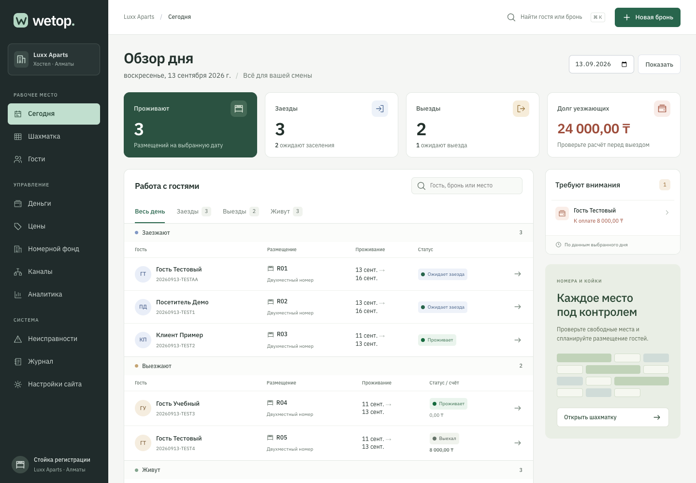
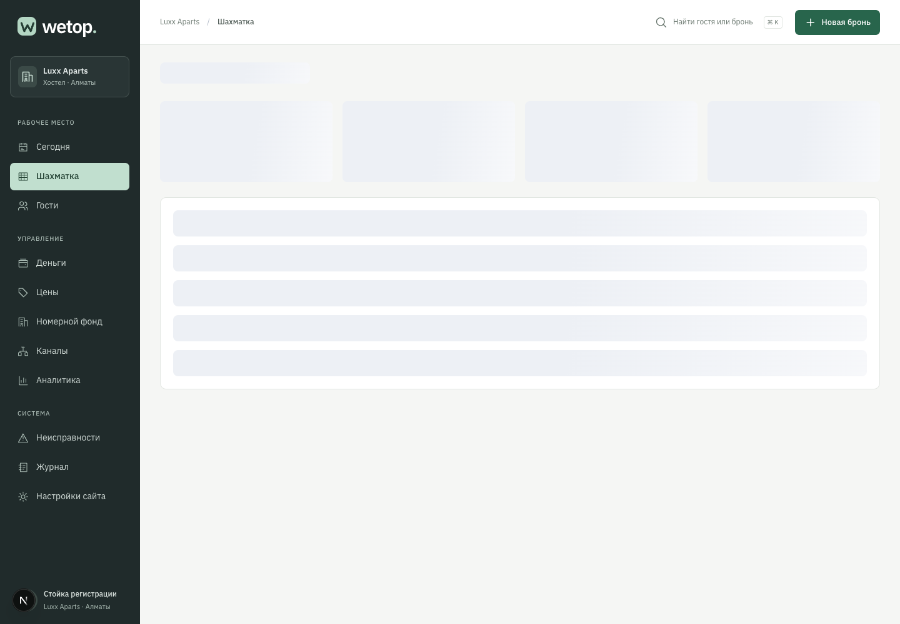
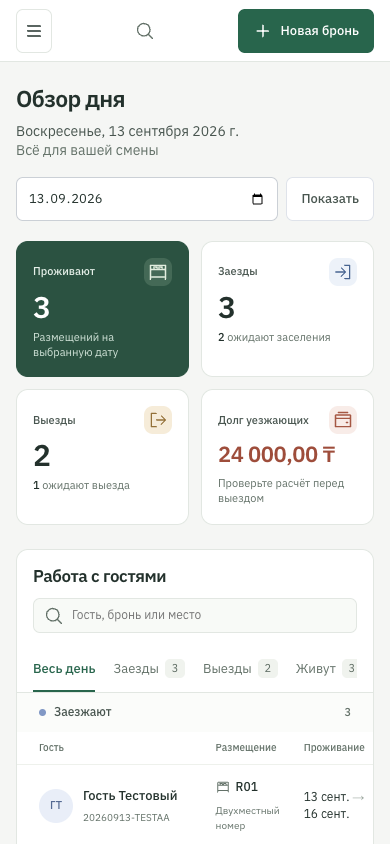

# WETOP — фронтенд хостела, 13.09.2026

Работа выполнена по прямому поручению владельца реализовать интерфейс по существующему коду.
Исходная версия `34883f7`; во время разработки включены изменения `main` до `8824974`, включая
сторожа, экран неисправностей и исправления пустых полей гостя. Решение — ADR-029.

## Обновлённый дизайн

Графитовая навигация и светлый рабочий экран с зелёным акцентом. Обзор дня собран вокруг списка
гостей: размещение и категория в одном блоке, календарные даты, заметный переход к действиям,
самостоятельная панель незаполненных карточек/неназначенных мест и долгов. Фильтр таблицы не
меняет сводку дня. Шахматка получила выделение текущей даты, панель периода, пиктограммы номеров
и коек, компактные неназначенные брони и раскрываемую инструкцию. Новых запросов API не добавлено.

Скриншоты ниже обновлены после переработки. Обзор дополнительно проверен на 320, 768 и 1024 px.
Исправлено переполнение на телефоне: скрытая подпись колонки теперь остаётся в контейнере таблицы.

## Реализовано

| Область | Поведение |
|---|---|
| Рабочее пространство | WETOP, разделы в боковом меню, активный маршрут, мобильный dialog с Escape и возвратом фокуса, быстрый поиск гостя/номера брони, новая бронь из шапки |
| Общий интерфейс | Светлая система на IBM Plex, единые формы, таблицы с внутренней прокруткой, skip-link, адаптация к телефону, состояния загрузки/ошибки/404, поддержка reduced motion |
| Сегодня | Показатели существующего API, весь день/заезды/выезды/живут, поиск по текущему дню, переходы к броням и размещению |
| Шахматка | 7/14/30 дней, поиск и категории, сворачивание категорий, подписи на целой полосе проживания, читаемые продолжения за левым краем, сохранённая дата каждой клетки и drag-and-drop |
| Свободная койка | Клик по клетке переносит даты и конкретную ячейку в форму. Недоступная на новом периоде ячейка объясняется сообщением |
| Создание брони | Несколько размещений и категорий в одной брони; quantity создаёт группу через текущий API. Отчество/email/заметка и все позиции сохраняются после конфликта. Неверная дата в URL не ломает страницу |
| Карточка брони | Быстрые переходы к обзору, проживаниям, счетам и действиям. Все существующие check-in/out, продление, отмена, no-show, даты и назначения сохранены. Тариф при смене категории и число детей передаются в поддержанные DTO |
| Гости | Профиль, контакты, история и документы в общей компоновке; добавлена поддержанная дата выдачи документа. Нет отдельной фиктивной кнопки создания клиента: гость появляется при бронировании |
| Деньги | Сохранены счета, начисления, платежи, возвраты и закрытие. Добавлен один платёж с распределениями по нескольким открытым счетам: сервер проверяет совпадение сумм, ошибка сохраняет ввод |
| Остальные разделы | Цены, фонд, уборка/блокировки, каналы, журнал, аналитика, настройки счётчика/виджета получают общий каркас. Коды единиц фонда открывают карточки |
| Неисправности | Новый экран из main включён в навигацию. Принятие и закрытие работают через существующие actions. Сбой списков не превращается в сообщение об отсутствии проблем |
| Печать | Существующие страницы RU/KZ сохранены; навигация рабочего пространства не попадает в печатную форму |

В карточке группы запрос доступности выполняется один раз на уникальный период проживания.
Поля ввода сумм отправляются десятичными строками; отображение ответов использует minor units.
Расчёт цен, доступности, статусов и денег остаётся в прежнем backend.

## Браузерная проверка

Настоящий Next.js и server actions работают с отдельным синтетическим API на loopback.
Фикстуры содержат вымышленных гостей и не встроены в приложение. Проверяются 15 экранов при
1440 × 1000 и 390 × 844, шахматка 88 × 30, формы, конфликты и повторы, мобильное меню,
профиль, заселение, общий платёж, неисправности, 404 и восстановление после HTTP 503.

Команды, требования и границы проверки: [tests/ui/README.md](../../tests/ui/README.md).
Каждый прогон, включая красные проверки до исправления, записан в [журнал](../../tests/runs/JOURNAL.md).
Финальные прогоны объединённой версии завершены 13.09.2026:

| Проверка | Результат | Доказательство |
|---|---|---|
| Unit | 536/536, 74 файла | [лог](../../tests/runs/logs/2026-09-13T13-47-58Z-unit-b3af.log) |
| TypeScript: root/API/web | без ошибок | [лог](../../tests/runs/logs/2026-09-13T13-47-56Z-typecheck-ac02.log) |
| ESLint | без ошибок | [лог](../../tests/runs/logs/2026-09-13T13-49-04Z-lint-b391.log) |
| Изолированные браузерные сценарии | 13/13, 34,8 с у Playwright | [лог](../../tests/runs/logs/2026-09-13T13-47-32Z-e2e-ac96.log) |
| `npm run build -w apps/web` | успешно, Next.js 16.3.4 / Turbopack, включая `/incidents` | после визуальной переработки; compiled 1,4 с, TypeScript 3,8 с |

В сценарии открытия экранов консоль браузера проверяется на ошибки. Ожидаемый HTTP 503
в отдельном негативном сценарии — намеренно вызванный отказ тестового API. Печать в браузере
проверена на регистрационной карте RU; содержание RU/KZ дополнительно покрывают существующие unit-тесты.

Ревью выполнено по корректности DTO, обработке ошибок, сохранению введённых данных, совместимости
с обновлённым main, точной передаче сумм, изоляции фикстур и сохранению прежних действий. Новых внешних
зависимостей и изменений схемы БД в diff относительно main нет.

## Границы результата

- С живой БД и внешними провайдерами этот фронтенд в данной сессии не прогонялся. Их прошлые отчёты
  в репозитории не заменяют проверку этой ветки на рабочем окружении.
- Production-нагрузка и конкурентные действия множества администраторов не измерялись.
  Сетка 88 × 30 работает в браузерном сценарии; это не обещание поддержки произвольного числа объектов.
- Нет новой авторизации, ролей или SaaS tenants: соответствующих работающих API в текущем scope нет.
  Нет фиктивного CRUD категорий/тарифов/услуг, слияния гостей или полного реестра броней с пагинацией.
- Фискализация и eQonaq не реализуются этим изменением. Не запускались production OTA-команды,
  изменения инфраструктуры или службы launchd.
- Перед рабочей сменой нужна проверка на настроенном dev/staging окружении с реальным API и БД,
  включая конкурентную бронь, переселение, выезд с долгом, печать и оплату.

## Скриншоты с вымышленными данными

