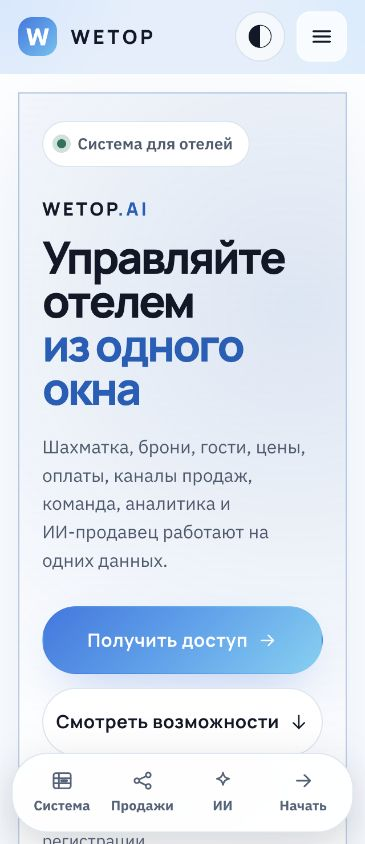

# PUBLIC-1: аудит главной WETOP.AI

Дата: 07.10.2026, Asia/Dubai. Статус: аудит и предложение для владельца, без реализации PUBLIC-2.

## Основание и границы доказательств

Fresh-check `git ls-remote origin refs/heads/main` и GitHub API вернули `e0089a230d8bd0b03751721d6e219faa628b904e`. Перед PR повторная проверка обнаружила новый main `94a2ae33416ece62d2bd18d8f3ef1896ed209702`. GitHub compare подтвердил: изменились CLAUDE.md, журнал/логи прогонов и tests/ui/branches.spec.ts; обязательные источники homepage/claims не изменились. Ветка обновлена на этот main перед отправкой. Чистая копия `main` получена в `/tmp/wetop-public1-20261007`, ветка `codex/public-1-homepage-audit-20261007`. Исходное дерево не переключалось: его Git pack `pack-8846768c8ff6218cf16edbc5a4e407db37ac3ea2.pack` имеет macOS-флаг `dataless`, чтение и fetch возвращали `Operation timed out`. Исходный каталог `tests/runs/.locks/` пуст; статус исходного дерева установить не удалось. Отдельная копия используется только для документации, без общей базы, запуска приложения и изменения runtime. Один агент.

Публичная страница https://wetop.ai/ обследована в браузере. DOM и видимые тексты соответствуют проверенным блокам свежего main, но SHA production-сборки этим не подтверждён. Наличие кода означает реализованный путь, а не проверку production-подключения. Вход, регистрация, resend и внешние API не отправлялись. Никаких production writes, deploy, миграций, изменений apps/sites или MKT-конструктора.

Прочитаны все обязательные файлы из задания: page.tsx, home.module.css, globals.css, header, mobile-menu, footer, auth-dialog, все landing/*.tsx, ru.ts, types.ts, lib/site.ts, registry.ts, trial.ts, unified-auth-entry.md, DESIGN.md и два предыдущих плана. Claims дополнительно сверены с API, доменом и рабочими экранами ниже. Старые планы и комментарии не заменяют current code: например, DESIGN §19.9 ещё упоминает 7 дней и отсутствие решения после trial, тогда как trial.ts содержит 14 дней и READ_ONLY.

## Главный вывод

Главная описывает гостиничную стойку. Продукт уже имеет три вертикали и общий контекст компании, бизнеса и филиала. Регистрация знает пилоты, но страница не объясняет их. Контент повторяет одни и те же гостиничные возможности, а сильный показ реального интерфейса заменён картой разделов. PUBLIC-2 должен менять структуру и иерархию, а не только слова.

## AS-IS: блоки, обещания и решения

Заголовки и лиды ниже взяты из current main; отсутствие текста или блока отмечено явно. Полная текущая копия значимых подпунктов приложена в конце отчёта.

| Блок / файл | Current heading | Current lead | Current CTA | Соответствие и действие |
|---|---|---|---|---|
| Header, `components/site-header.tsx` | WETOP | Нет | Для кого / Возможности / Продажи / Как начать; Войти; Получить доступ | **REWRITE P1**. Ссылки рабочие; нет Продукта и ИИ, действие регистрации названо косвенно. Блог условно появляется при опубликованных статьях, в текущем live отсутствует. |
| Hero, `components/landing/hero.tsx` | Управляйте отелем из одного окна | Шахматка, брони, гости, цены, оплаты, каналы продаж, команда, аналитика и ИИ-продавец работают на одних данных. | Получить доступ / Смотреть возможности | **REWRITE P1. Hotel-only; убрать общий намёк на доступность всех расширений.** |
| Facts, `components/landing/facts.tsx` | Коротко о WETOP | Четыре факта: Одна база; Все источники броней; Деньги на месте; Работает в браузере | Нет | **REWRITE P1. Одна база и браузер подтверждены; все источники и финансовые claims только Hospitality, не вся платформа.** |
| Audience, `components/landing/audience.tsx` | Отели, хостелы и апартаменты | Номера и койко-места на одной шахматке, брони из каналов продаж, счета гостей и работа стойки. У каждого типа объекта своя страница с подробностями. | Подробнее / Написать нам | **REWRITE P1. Три типа размещения вместо трёх vertical; Food отсутствует, Beauty без статуса.** |
| Features, `components/landing/features.tsx` | Что умеет WETOP | Восемь разделов стойки на одних данных. Бронь, гость, место и счёт связаны между собой, выгружать из одной программы в другую ничего не нужно. | Нет | **REWRITE P1. Реальные гостиничные модули смешаны с неподтверждённой скоростью и учётом способов оплаты.** |
| Market, `components/landing/market.tsx` | Загрузка конкурентов: продавайте дороже, когда рынок полон | Добавьте отели рядом с вами и вносите их загрузку на ближайшие ночи. WETOP поставит её рядом с вашей загрузкой из календаря и подскажет, где соседи распроданы и цену можно поднять, а где спрос слабый и пора акция. | Открыть раздел → app.wetop.ai/market | **MOVE P2. Реальное сравнение загрузки, ручные наблюдения; отдельный большой блок перегружает platform homepage.** |
| Sales, `components/landing/sales.tsx` | Откуда приходят брони | Четыре входа и одни правила: бронь из любого источника встаёт на ту же шахматку и получает такой же счёт гостя. | Как это устроено / Открыть калькулятор | **REWRITE P1. Подключения условны, повтор Features; оставить компактный Hospitality-фрагмент в продажах.** |
| AI Sellers, `components/landing/ai-sellers.tsx` | ИИ-продавец отвечает клиентам по вашим правилам | Вы задаёте знания об объекте и стиль общения, проверяете ответы в тестовом диалоге и только потом подключаете канал. Знания и настройки остаются под вашим контролем. | Открыть ИИ-продавцов → /ai-seller/agents | **REWRITE P1. Legacy расширение и новые draft agents имеют разную готовность; текущий CTA ведёт к draft-only редактору.** |
| Team, `components/landing/team.tsx` | Команда и доступ | Сотрудников приглашаете сами, права проверяет система, каждое действие остаётся в журнале. | Нет | **KEEP / REWRITE P2. Роли и аудит есть; «каждое действие» слишком абсолютное, шифрование документа только Hospitality.** |
| Start, `components/landing/start.tsx` | Четыре шага до первой брони | Создайте аккаунт, подтвердите почту и настройте бизнес. Подключение каналов и перенос существующих данных согласуются отдельно. | Получить доступ / почта / wetop.ai (#login) | **REWRITE P1. Гостиничная инструкция не подходит пилотам; финальный CTA переместить после FAQ.** |
| FAQ, `components/landing/faq.tsx` | Вопросы и ответы | Нет общего лида | Нет | **REWRITE P1. Шесть гостиничных вопросов, нет Food и различий доступа.** |
| Company, `components/landing/company.tsx` | Не рендерится: company.name пустое | Нет общего лида | Нет | **KEEP conditional P3. Имя компании пустое, блок не рендерится, реквизиты не придумывать.** |
| Blog, `components/landing/latest-posts.tsx` | Не рендерится: нет опубликованных статей | Статьи о WETOP и о работе хостелов и мини-отелей. | Нет | **MOVE P3. Нет опубликованных статей в live; оставить только условную ссылку в footer, без пустого блока.** |
| Footer, `components/site-footer.tsx` | WETOP | Центр управления сервисным бизнесом | Калькулятор комиссии OTA / Войти | **REWRITE P1**. Позиционирование уже шире Hero, нет регистрации и privacy, контакты выше в Start. |
| Login, `components/auth-dialog.tsx` | Вход в WETOP | Почта и пароль вашей учётной записи. | Войти / Забыли пароль? / Получить доступ | **KEEP / REWRITE P1**. Сохранить мост, сессию и fallback; исправить подпись регистрации и термин «стойка». |
| Registration, `components/auth-dialog.tsx` | Новый аккаунт | Создайте аккаунт. Пришлём письмо, подтвердите почту, и откроется настройка бизнеса. | Создать аккаунт / Вход | **KEEP / REWRITE P1**. Три vertical и статусы уже есть; пилот должен до отправки объяснять серверный allowlist. |
| Mobile menu, `components/mobile-menu.tsx` | Меню | Нет | Копия navigation + Войти / Получить доступ | **REWRITE P1**. Register скрыт в закрытом header, возврат фокуса после auth из меню теряется. |
| MobileHomeNav, `landing/mobile-home-nav.tsx` | Разделы главной | Нет | Система / Продажи / ИИ / Начать | **REMOVE P2**. Дублирует меню, занимает нижнюю часть экрана и не содержит прямой регистрации. |
| SEO, `i18n/ru.ts`, `lib/metadata.ts`, `app/layout.tsx` | WETOP: управляйте отелем из одного окна | WETOP объединяет шахматку, брони, гостей, цены, оплаты, каналы продаж, команду, аналитику и ИИ-продавца в одном рабочем пространстве. | Не применимо | **REWRITE P1**. Сохранить canonical, locale и OG; расширить семантику и обозначить пилоты. |

## Матрица claims и current-code evidence

| Claim | Код / факт | Вердикт и публичная формулировка |
|---|---|---|
| «Система для отелей», «Управляйте отелем» | `packages/domain/src/verticals/registry.ts`, `BUSINESS_VERTICALS`, AVAILABLE/PILOT | Устаревшее позиционирование. «Платформа для ежедневной работы бизнеса», с отдельными статусами. |
| Только хостелы, мини-отели и апарт-отели | `apps/web/src/lib/navigation.ts`, beautyMenuSections, foodMenuSections; `/today` dispatch | Неполный охват. Первый уровень: гостиничный бизнес, салоны/студии, кафе/рестораны. |
| Beauty «деньги считаются так же»; комментарии «функций нет» | `apps/api/src/beauty/beauty.module.ts`, appointments.ts, schedule.ts; `apps/web/src/app/customers/page.tsx`, beauty/*; деньги не входят в этот контур | Некорректное финансовое обобщение, устаревшие комментарии. Публично: записи, клиенты, услуги, мастера, график, только пилот. |
| Food отсутствует | `apps/api/src/food-service/food.module.ts`, food.service.ts; `apps/web/src/app/food/screen.tsx`, catalog-board.tsx; `packages/domain/src/food/food.ts` | Реализованы план зала, брони столов, гости, залы/столы, периоды обслуживания. Пилот. POS, заказы, кухня, склад ресторана, доставка, депозиты не обещаются. |
| «Тарифы и цены», «задайте тарифы» | `navigation.ts`: «Категории номеров»; `apps/web/src/app/rooms/categories/`, `rates/`; домен rates | Не отсутствие pricing, а устаревшая точка входа и узкий onboarding. «Категории и цены» для Hospitality; для Beauty услуги/длительность/цены, для Food периоды. Существующие правила расчётов не менять. |
| «Брони приходят за секунды» | `apps/api/src/channels/inbound.service.ts`: webhook + периодический feed (по умолчанию раз в 5 минут), отключение без ключа; outbox.worker.ts, ari-switch.ts | Неподтверждённая гарантия времени. «Брони и доступность синхронизируются через подключённый менеджер каналов». Без SLA. |
| Шесть названных OTA как готовые подключения всем | `apps/api/src/channels/catalog.ts`: каталог Channex, маппинг и состояние по фактам; integration-owner.ts | Наличие адаптера не подтверждает активацию у клиента. Убрать повторяющиеся списки; подключение зависит от канала и настроек объекта. |
| «Девять способов оплаты», Kaspi/Halyk | `packages/database/prisma/schema.prisma`: PaymentMethod (9 enum); `packages/domain/src/finance/payment-request.ts` | 9 видов учётных записей, не 9 готовых acquiring integrations. Kaspi-счёт выставляется вручную. «Учитывайте оплаты, возвраты и задолженность». Не обещать встроенный приём платежей. |
| «Все источники... пишут в одну шахматку» | Hospitality reservation/folio paths; Beauty appointments; Food tableReservations | Верно только как Hospitality-контур после подключения источников; не общий workflow всех vertical. «Каждое направление получает своё рабочее пространство». |
| «Сайт объекта» | `apps/web/src/app/website/page.tsx`, forms.tsx; widget module, аналитика; marketing/page.tsx требует HOSPITALITY | Подтверждены подключаемый виджет и аналитика гостиничного сайта. Не обещать сайт всем сразу после signup. |
| AI-конструктор сайта | `apps/api/src/marketing-site/marketing-site.module.ts`: brief/draft/versions; `sites-runtime/host-resolver.ts`: production запрещён; `plans/mkt5-site-brief-2026-10-07.md` | Бриф и версии не генерация. Не включать в публичную копию PUBLIC-2 без новой сверки main и разрешённого пользовательского production-flow. Код MKT не менялся. |
| Market / автоматический AI-сбор | `packages/domain/src/market/occupancy.ts`: buildMarketBoard, buildNightHistory; market.service.ts, collector.service.ts | Сравнение и подсказки реальны; не гарантия роста цены/выручки. Не обещать автоматический сбор как доступную функцию. Короткое уточнение: «Данные конкурентов добавляете вы». |
| «ИИ-продавец», сайт и WhatsApp | `apps/web/src/app/ai-seller/[[...section]]/page.tsx`: legacy настройки, знания, тест, диалоги, human takeover; seller.service.ts | Отдельное расширение, зависит от подключения и настройки. Не обещать единый seller для всех pilot vertical и точное наличие из любого бизнеса. |
| CTA «Открыть ИИ-продавцов» → `/ai-seller/agents` | `apps/web/src/app/ai-seller/agents/editor.tsx`: «Сохранение не запускает агента... ещё в разработке» | Смешивает работающий legacy seller с draft-only multi-agent UI. На homepage использовать объясняющий якорь, без этого CTA. |
| «Три роли» | `packages/domain/src/accounts/permissions.ts`, navigation.ts: OWNER/MANAGER/STAFF | Подтверждено. «Приглашайте сотрудников и задавайте роли». Журнал подтверждённых операций, не «каждое действие» в абсолютном смысле. |
| «Каждую минуту проверяет» | `apps/api/src/guard/guard.service.ts`: GUARD_TICK_MS = 60_000 | Интервал в коде есть, включение runtime не подтверждено. Техническую деталь убрать с главной; не обещать автономное управление бизнесом. |
| 14 дней всем | `packages/domain/src/accounts/trial.ts`: TRIAL_DAYS=14; auth.service.ts: trial создаётся в транзакции регистрации | Период начинается при создании организации, не после email или завершения настройки. После истечения READ_ONLY, вход и просмотр сохраняются. Пилоты не получают публичного обещания self-service trial. |
| Регистрация всех vertical | auth.service.ts: registrationOpen; registration-contract.ts: assertRegistrationVertical | Hospitality проходит vertical gate, но действует общий REGISTRATION_OPEN. Beauty/Food требуют точного server email allowlist; пустой список закрыт. Списки не выводить. Live форма открыта, runtime options-флаг отдельно не считан. |
| Несколько бизнесов/филиалов | schema Business/Location, `apps/api/src/auth/scope.ts`, request-context.ts, `apps/web/src/components/shell/branch-switcher.tsx` | Цепочка и scope реализованы. Не обещать общую аналитику, единый баланс или автоматический перенос клиентских данных между направлениями. |

## Дубли и отсутствие информации

Шахматка повторена в Hero map, Facts, Audience, Features и FAQ; каналы в Facts, Features, Sales и FAQ; браузер в Hero, Facts, Team, Start и FAQ; AI в Hero, Sales, отдельном AI и FAQ. Company/Blog не видны, потому что действуют условия, это не сломанная верстка. Общего объяснения платформы, Food, понятной зрелости vertical и ограничений пилота нет. Финальный CTA размещён до FAQ и выглядит как гостиничный контактный блок.

## Auth и registration audit

Сохранить ADR-131, `docs/unified-auth-entry.md`, `apps/site/src/lib/site.ts`: `/#login`, `/#register`, AuthDialog, `/api/site-auth/options|login|register|resend|session`, POST credentials, HttpOnly-cookie приложения, session-check перед переходом, безопасный relative next, `/auth/fallback`, verify/reset/set-password/check-email/invite. Новую landing-страницу входа не создавать.

В current main submitRegister передаёт vertical + businessName; fallback сохраняет vertical. Форма: Имя, Название бизнеса, код страны/Телефон, Почта, Пароль, privacy checkbox. Пилот имеет статус «Подключение по приглашению» и отдельный лид, но «Создайте аккаунт... чтобы подключиться» создаёт ожидание допуска любого email. Сервер отвечает 403 «Направление пока доступно только участникам пилота». Исправление требуется в объяснении до отправки, без изменения gate.

Состояния errors предусмотрены: обязательные поля, privacy, сеть/fallback, неподтверждённая почта, несохранённая сессия. При options timeout форма остаётся в unknown; не писать безусловно «Регистрация открыта». При sent:false копия признаёт неотправленное письмо, однако обещание «откроем вход вручную» не подтверждает SLA поддержки. Verification token живёт 72 часа (`packages/domain/src/accounts/email-verification.ts`), resend server cooldown 60 секунд (`apps/api/src/auth/email-verification.service.ts`), UI pause тоже 60 секунд. Новый signup/resend не проверялся в production. Таб «Указать другую почту» возвращает форму, не является обновлением уже созданной учётной записи, копию лучше заменить на «Вернуться к форме».

## Mobile и accessibility: фактическая проверка

| Проверка | Результат / ограничение |
|---|---|
| Homepage 320/390/768/1440 px | documentElement.scrollWidth совпал с innerWidth: 320/390/768/1440. Горизонтального overflow в проверенных состояниях нет. |
| Header 320/390/768 | При закрытом меню register CTA отсутствует в header; доступен в Hero и открытом menu. В PUBLIC-2 оставить «Регистрация» постоянно видимой. |
| Menu 320 | Открывается кнопкой «Меню», имеет aria-expanded, рабочие ссылки, самостоятельный login/register. |
| Auth 320×740 | dialog 282×708, x=19/y=16, находится внутри viewport; внутренний scroll есть. Поле телефона сжато до нескольких знаков, две колонки нужно сложить вертикально. Screenshot отражает прокрутку к нижним полям. |
| Register/Login 390 | Сохранены снимки пустых форм; выбор пилота отображает отдельное пояснение. Отправка не выполнялась. |
| Close desktop | После открытия из header закрытие возвращает фокус на «Получить доступ». |
| Escape после mobile menu | Диалог закрывается, focus уходит на body: триггер скрыт при закрытии menu. PUBLIC-2 должен возвращать фокус на постоянно видимый register или menu button. |
| Auth tabs | aria tablist/tab/tabpanel есть; у обоих tab нет roving tabindex; ArrowRight не переключает выбранный tab. Требуется корректная keyboard tab pattern или другая семантика. |
| Heading/nav | Один h1, именованные main nav и sections, skip-link, нативные FAQ details. Не найдено доказательства полного нарушения heading tree. |
| Focus | Видимый outline предусмотрен globals.css; UI поля показывают ring. Потеря focus при mobile auth подтверждена отдельно. |
| Contrast primary CTA, light | Computed: white 16px/700 на gradient rgb(47,122,229) → rgb(74,166,240) → rgb(110,210,245). Контраст к стопам 4.17 / 2.62 / 1.72: ниже 4.5:1 для этого размера. Требуется однотонный контрастный CTA. |
| Reduced motion | CSS включает движение под no-preference и имеет reduce overrides. Emulation не выполнялась, считать непроверенным runtime, включить в PUBLIC-2 gate. |
| Console | Browser captured error/warn log пуст при осмотре. Это не доказательство всех network paths. |
| Axe | Свежий axe-run не выполнялся: доступного Chrome DevTools MCP нет, использован CUA с read-only DOM. В репозитории уже есть AxeBuilder в tests/site/landing.spec.ts; прежние результаты не выданы за сегодняшние. Полный axe обоих themes и auth обязателен в PUBLIC-2. |
| Реальная клавиатура телефона | Desktop viewport эмуляция не подтверждает visualViewport/OS keyboard. Нужен отдельный manual или device check до приёмки PUBLIC-2. |

Светлая и тёмная темы визуально просмотрены. Нет фонового видео или stock-фото; примеры подписаны, без настоящих guest data. Главная уже частично снимает glass через home.module.css, но hero glow/perspective, gradient CTA, стеклянный footer и нижняя navigation ещё доминируют над показом продукта.

## SEO audit

Live title и description совпали с ru.meta. Canonical https://wetop.ai/, один h1. pageMetadata и layout сохраняют OpenGraph/locale, shared 1200×630 og.png. Публичная семантика только Hospitality, без пилотов. PUBLIC-2 должен согласовать title, description, OG text/image и Hero; изображения metadata проверить на устаревший гостиничный текст. robots/sitemap и все segment pages не переписывать автоматически. Три варианта SEO находятся в плане.

## Приоритеты

- P0: обнаруженной утечки данных, обхода auth или обязательной production-аварии в этом read-only аудите нет. Не выводить пилоты в открытый signup, не публиковать AI/site generation как доступное; это обязательные publication gates.
- P1: multi-vertical Hero/SEO; статусы и пилотный signup copy; Food; исправление Beauty money claim; неподтверждённая скорость каналов; distinction payments vs acquiring; AI draft CTA; контраст primary CTA; keyboard tabs и mobile focus return; постоянно видимая регистрация.
- P2: убрать дубли, mobile dock и отдельный большой Market; заменить карту разделов на 3-4 UI-показа; исправить тесное поле телефона; универсальный start с реальным порядком выбора vertical.
- P3: условный Blog в footer; сохранить hiding Company, уточнить контакты; очистить устаревшие комментарии только в изменяемых PUBLIC-2 строках.

## Screenshots текущего состояния

Снимки получены из рабочего сайта 07.10.2026. В auth поля почты/пароля очищены перед снимками, forms не отправлялись. Метки «light» подтверждены data-theme=light перед финальными снимками. Остальные снимки в системной тёмной теме. Full-page screenshots 1440 показывают весь порядок блоков.

- [Главная 1440 dark](screenshots/home-1440.jpg)
- [Главная 1440 light](screenshots/home-1440-light.jpg)
- [Главная 320](screenshots/home-320.jpg)
- [Главная 390 dark](screenshots/home-390.jpg)
- [Главная 390 light](screenshots/home-390-light.jpg)
- [Главная 768](screenshots/home-768.jpg)
- [Menu 320](screenshots/menu-320.jpg)
- [Регистрация 1440](screenshots/register-1440.jpg)
- [Пилот 1440](screenshots/pilot-1440.jpg)
- [Регистрация 320](screenshots/register-320.jpg)
- [Регистрация 390](screenshots/register-390.jpg)
- [Вход 390](screenshots/login-390.jpg)

## Owner summary

1. Сейчас сайт объясняет только гостиницу, а продукт уже имеет несколько направлений с разной доступностью.
2. Хорошо: единый auth, реальные функции Hospitality, подписанные synthetic mockups, обе темы, нативный FAQ, условные Company/Blog, отсутствие выдуманных отзывов.
3. Устарели: «Система для отелей», универсальная гостиничная настройка, отсутствие Food, комментарии об отсутствии Beauty, «Тарифы и цены» как основной публичный ярлык.
4. Убрать: гарантию секунд, wall of modules, повторные OTA lists, общий Beauty money claim, draft-agent CTA, большой Market и нижний mobile dock.
5. Добавить: три vertical с явными статусами, объяснение компании/бизнесов/филиалов, 3-4 крупных product previews, pilot access copy, понятный footer.
6. Новая структура: Hero → три направления → одна платформа → product showcase → задачи пользователей → AI → продажи/маркетинг → как начать → FAQ → финальный CTA → footer.
7. В первые 10 секунд посетитель увидит платформу для ежедневной работы, её конкретные задачи, три направления и кнопку регистрации.
8. Hospitality доступен; Beauty/Food показаны полноценными направлениями с ограниченным пилотом, без финансов/POS и обещания открытого trial.
9. Войти остаётся secondary, Регистрация становится primary. Хэши, bridge и cookie остаются; меняются labels и a11y поведения, не правила доступа.
10. Владельцу нужны: утверждение Homepage V2 и Hero A; согласование термина «Пилот» и маршрута обращения за приглашением; решение, показывать ли условный Hospitality trial; разрешённый перечень AI claims до PUBLIC-2. Архитектура и бизнес-правила в PUBLIC-1 не принимаются и не меняются. Вопросы находятся в плане, QUESTIONS.md не изменяется по заданному diff scope.

## Приложение: точная AS-IS копия подпунктов

Снимок текущих текстов, для сравнения при PUBLIC-2. Старые длинные тире заменены на двоеточие в цитатах отчёта согласно AGENTS §19; source не менялся.

### hero

- `status`: Система для отелей
- `title`: Управляйте отелем
- `titleAccent`: из одного окна
- `lead`: Шахматка, брони, гости, цены, оплаты, каналы продаж, команда, аналитика и ИИ-продавец работают на одних данных.
- `secondary`: Смотреть возможности
- `note`: Работает в браузере. Начните настройку сразу после регистрации.
- `map.label`: Разделы WETOP
- `map.title`: Рабочее пространство
- `map.hint`: Что внутри
- `map.items[0].icon`: grid
- `map.items[0].title`: Операции
- `map.items[0].text`: Шахматка, брони, заезды и выезды
- `map.items[0].href`: #features
- `map.items[1].icon`: channels
- `map.items[1].title`: Продажи
- `map.items[1].text`: Каналы продаж, сайт объекта, тарифы и цены
- `map.items[1].href`: #sales
- `map.items[2].icon`: shield
- `map.items[2].title`: Команда
- `map.items[2].text`: Роли, приглашения, журнал действий
- `map.items[2].href`: #team
- `map.items[3].icon`: receipt
- `map.items[3].title`: Финансы
- `map.items[3].text`: Счета гостей, оплаты, возвраты, долги
- `map.items[3].href`: #features
- `map.items[4].icon`: chart
- `map.items[4].title`: Аналитика
- `map.items[4].text`: Загрузка, выручка, источники броней
- `map.items[4].href`: #features
- `map.items[5].icon`: spark
- `map.items[5].title`: ИИ-продавцы
- `map.items[5].text`: Агент отвечает клиентам по вашим знаниям
- `map.items[5].href`: #ai-sellers
- `map.caption`: Схема разделов рабочего пространства, не снимок системы.

### facts

- `label`: Коротко о WETOP
- `items[0].icon`: migrate
- `items[0].title`: Одна база
- `items[0].text`: Бронь, гость, место и счёт связаны между собой.
- `items[1].icon`: channels
- `items[1].title`: Все источники броней
- `items[1].text`: Площадки, сайт, стойка и ИИ-продавец пишут в одну шахматку.
- `items[2].icon`: receipt
- `items[2].title`: Деньги на месте
- `items[2].text`: Счета, оплаты, возвраты и долги. Суммы считаются до тиына.
- `items[3].icon`: globe
- `items[3].title`: Работает в браузере
- `items[3].text`: Ставить ничего не нужно, у каждого сотрудника своя роль.

### audience

- `eyebrow`: Для кого
- `title`: Отели, хостелы и апартаменты
- `lead`: Номера и койко-места на одной шахматке, брони из каналов продаж, счета гостей и работа стойки. У каждого типа объекта своя страница с подробностями.
- `items[0].icon`: bed
- `items[0].title`: Хостелы
- `items[0].text`: Койка и номер лежат на одной шахматке, и у каждой свои брони, заселение и счёт.
- `items[0].segment`: hostels
- `items[1].icon`: building
- `items[1].title`: Мини-отели
- `items[1].text`: Номера по категориям, календарь цен и ограничений, брони из каналов и со стойки.
- `items[1].segment`: mini-hotels
- `items[2].icon`: key
- `items[2].title`: Апарт-отели
- `items[2].text`: Апартаменты на шахматке: брони из каналов, продление, пересадка и счета гостей.
- `items[2].segment`: apart-hotels
- `more`: Подробнее
- `caption`: Пример шахматки: номера и койки в одной сетке, брони из разных каналов.
- `invite.title`: Салоны и студии
- `invite.text`: Подключаем сервисный бизнес без номеров: клиенты, услуги, команда и деньги считаются так же.
- `invite.action`: Написать нам

### features

- `eyebrow`: Возможности
- `title`: Что умеет WETOP
- `lead`: Восемь разделов стойки на одних данных. Бронь, гость, место и счёт связаны между собой, выгружать из одной программы в другую ничего не нужно.
- `items[0].icon`: grid
- `items[0].title`: Шахматка
- `items[0].text`: Номера и койки на одной сетке. Неделя, 14 дней или месяц, перенос брони мышью.
- `items[1].icon`: guest
- `items[1].title`: Брони и гости
- `items[1].text`: Ручные и групповые брони, заезд и выезд, карточка гостя с историей проживаний.
- `items[2].icon`: channels
- `items[2].title`: Каналы продаж
- `items[2].text`: Брони с площадок приходят за секунды, остатки уходят обратно сами.
- `items[2].tags[0]`: Booking.com
- `items[2].tags[1]`: Trip.com
- `items[2].tags[2]`: Agoda
- `items[2].tags[3]`: Expedia
- `items[2].tags[4]`: Hostelworld
- `items[2].tags[5]`: Островок
- `items[3].icon`: tag
- `items[3].title`: Тарифы и цены
- `items[3].text`: Календарь цен и ограничений, правка сразу на период, скидки и промокоды.
- `items[4].icon`: receipt
- `items[4].title`: Счета и оплаты
- `items[4].text`: Счёт на каждое проживание, девять способов оплаты, возвраты и штраф по тарифу.
- `items[5].icon`: site
- `items[5].title`: Сайт объекта
- `items[5].text`: Виджет бронирования и счётчик посещений без персональных данных.
- `items[6].icon`: chart
- `items[6].title`: Аналитика и финансы
- `items[6].text`: Загрузка, выручка, источники броней и долги за период, выгрузка в CSV.
- `items[7].icon`: shield
- `items[7].title`: Сторож системы
- `items[7].text`: Каждую минуту проверяет каналы, очереди и базу. По деньгам зовёт человека.

### market

- `eyebrow`: Загрузка конкурентов
- `title`: Загрузка конкурентов: продавайте дороже, когда рынок полон
- `lead`: Добавьте отели рядом с вами и вносите их загрузку на ближайшие ночи. WETOP поставит её рядом с вашей загрузкой из календаря и подскажет, где соседи распроданы и цену можно поднять, а где спрос слабый и пора акция.
- `points[0].title`: Вы и рынок по ночам
- `points[0].text`: Ваша загрузка из календаря рядом с загрузкой каждого соседа на каждую ночь.
- `points[1].title`: Средняя по рынку и разница
- `points[1].text`: На сколько пунктов вы выше или ниже рынка, ночь за ночью.
- `points[2].title`: Изменения со вчера
- `points[2].text`: Видно, как быстро соседи заполняются: со вчера или с прошлой недели.
- `points[3].title`: Подсказки к цене
- `points[3].text`: Где рынок почти полон, где спрос слабый, со ссылкой в календарь цен.
- `preview.label`: Пример таблицы загрузки на одну ночь
- `preview.hint`: Пример
- `preview.title`: Суббота, 17 октября
- `preview.items[0].term`: Отель рядом, 200 м
- `preview.items[0].text`: 94 %
- `preview.items[1].term`: Хостел через улицу
- `preview.items[1].text`: 90 %
- `preview.items[2].term`: Средняя по рынку
- `preview.items[2].text`: 92 %
- `preview.items[3].term`: Вы
- `preview.items[3].text`: 61 %
- `preview.note`: Рынок почти полон, у вас есть места: цену на эту ночь можно поднять. Сейчас загрузку соседей вносите вы; автоматический сбор ИИ-агентом готовим.
- `preview.open`: Открыть раздел
- `preview.signIn`: Раздел «Загрузка конкурентов» в «Продажах», нужен вход в аккаунт.

### sales

- `eyebrow`: Продажи
- `title`: Откуда приходят брони
- `lead`: Четыре входа и одни правила: бронь из любого источника встаёт на ту же шахматку и получает такой же счёт гостя.
- `items[0].icon`: channels
- `items[0].title`: Площадки бронирования
- `items[0].text`: Категории и тарифы сопоставляются один раз, дальше брони и остатки ходят сами.
- `items[0].tags[0]`: Booking.com
- `items[0].tags[1]`: Trip.com
- `items[0].tags[2]`: Agoda
- `items[0].tags[3]`: Expedia
- `items[0].tags[4]`: Hostelworld
- `items[0].tags[5]`: Островок
- `items[1].icon`: site
- `items[1].title`: Сайт объекта
- `items[1].text`: Гость выбирает даты и категорию, вводит промокод, бронь сразу в системе.
- `items[2].icon`: phone
- `items[2].title`: Стойка, телефон и мессенджеры
- `items[2].text`: Поиск свободных мест по датам и числу гостей сразу показывает цену.
- `items[3].icon`: spark
- `items[3].title`: ИИ-продавец
- `items[3].text`: Отвечает в чате на сайте и в WhatsApp по знаниям вашего объекта.
- `items[3].link`: Как это устроено
- `calculator.title`: Сколько уходит в комиссию площадок
- `calculator.text`: Сколько вы платите площадкам за месяц и сколько останется, если часть броней придёт напрямую.
- `calculator.link`: Открыть калькулятор

### ai

- `eyebrow`: ИИ-продавцы
- `title`: ИИ-продавец отвечает клиентам по вашим правилам
- `lead`: Вы задаёте знания об объекте и стиль общения, проверяете ответы в тестовом диалоге и только потом подключаете канал. Знания и настройки остаются под вашим контролем.
- `steps[0].title`: Расскажите о бизнесе
- `steps[0].text`: Что вы предлагаете, кому помогаете и о чём клиенты спрашивают чаще всего.
- `steps[1].title`: Настройте характер
- `steps[1].text`: Имя агента, язык и стиль общения. Знания, на которые он опирается в ответах.
- `steps[2].title`: Проверьте ответы
- `steps[2].text`: Задайте вопросы в тестовом диалоге и поправьте неточные ответы до запуска.
- `steps[3].title`: Подключите и управляйте
- `steps[3].text`: Завершите настройку модели и канала. Возвращайтесь к знаниям, когда что-то меняется.
- `preview.label`: Пример настройки ИИ-продавца
- `preview.hint`: Пример настройки
- `preview.title`: Что должен знать агент
- `preview.items[0].term`: Ваше предложение
- `preview.items[0].text`: Категории размещения, услуги и условия
- `preview.items[1].term`: Правила объекта
- `preview.items[1].text`: Заезд, выезд, отмена и способы связи
- `preview.items[2].term`: Стиль общения
- `preview.items[2].text`: Язык, тон и подробность ответов
- `preview.items[3].term`: Проверка перед запуском
- `preview.items[3].text`: Тестовые вопросы и уточнение знаний
- `preview.note`: ИИ-продавец: отдельное расширение. Агент начинает работать после настройки модели и подключения канала. Ответы нужно проверить на данных вашего бизнеса.
- `preview.open`: Открыть ИИ-продавцов
- `preview.signIn`: Для управления агентами нужен вход в аккаунт.

### team

- `eyebrow`: Команда
- `title`: Команда и доступ
- `lead`: Сотрудников приглашаете сами, права проверяет система, каждое действие остаётся в журнале.
- `items[0].icon`: guest
- `items[0].title`: Три роли
- `items[0].text`: Владелец, управляющий и администратор. Что доступно сотруднику, решает роль.
- `items[1].icon`: article
- `items[1].title`: Журнал действий
- `items[1].text`: Кто и когда создал бронь, изменил цену или провёл оплату.
- `items[2].icon`: globe
- `items[2].title`: Работает в браузере
- `items[2].text`: Ставить на компьютер нечего. Номер документа гостя хранится зашифрованным.

### start

- `eyebrow`: Как начать
- `title`: Четыре шага до первой брони
- `lead`: Создайте аккаунт, подтвердите почту и настройте бизнес. Подключение каналов и перенос существующих данных согласуются отдельно.
- `steps[0].title`: Создайте аккаунт
- `steps[0].text`: Нажмите «Получить доступ» и заполните форму. Почта нужна рабочая.
- `steps[1].title`: Подтвердите почту
- `steps[1].text`: Откройте ссылку из письма и войдите с почтой и паролем.
- `steps[2].title`: Настройте объект
- `steps[2].text`: Добавьте категории, номера или койки, задайте тарифы, позовите сотрудников.
- `steps[3].title`: Начните работу
- `steps[3].text`: Создайте первую бронь и заселите гостя. Каналы подключаются по одному.
- `ctaTitle`: Попробуйте на своём объекте
- `ctaText`: Создайте аккаунт и начните настройку. Остались вопросы: напишите нам, покажем систему и поможем с переносом данных.
- `contactsLabel`: Контакты
- `cityLabel`: Город
- `siteLabel`: Сайт
- `connectLabel`: Вход в стойку
- `connectText`: Стойка открывается в браузере: ставить на компьютер нечего.

### faq

- `eyebrow`: Вопросы
- `title`: Вопросы и ответы
- `items[0].q`: Можно продавать номера и отдельные койки?
- `items[0].a`: Да. Номер и койко-место в WETOP отдельные единицы размещения: у каждой свои брони, заселение и счёт. Они объединяются в категории и лежат на одной шахматке.
- `items[1].q`: Для какого бизнеса WETOP доступен сейчас?
- `items[1].a`: Система работает для хостелов, мини-отелей и апарт-отелей: номера, койки, брони и счета гостей. Салоны и студии подключаем отдельно, напишите нам, и мы разберём ваш случай.
- `items[2].q`: Можно подключить площадки бронирования?
- `items[2].a`: Да, через встроенный менеджер каналов. Категории и тарифы сопоставляются при подключении объекта, затем брони приходят автоматически, а остатки уходят на площадки.
- `items[3].q`: Что делает ИИ-продавец?
- `items[3].a`: Отвечает клиентам по знаниям вашего объекта: наличие, цены, условия. Вы задаёте знания и стиль общения, проверяете ответы в тестовом диалоге и подключаете канал. Это отдельное расширение.
- `items[4].q`: Нужна ли установка на компьютер?
- `items[4].a`: Нет. Рабочее пространство открывается в браузере. Сотрудникам вы даёте роли, права проверяет система.
- `items[5].q`: Как начать?
- `items[5].a`: Создайте аккаунт, подтвердите почту, опишите номера и цены. Подключение каналов и перенос данных согласуются отдельно.

### auth

- `dialogLabel`: Вход и регистрация в WETOP
- `close`: Закрыть
- `tabs.login`: Вход
- `tabs.register`: Получить доступ
- `login.title`: Вход в WETOP
- `login.lead`: Почта и пароль вашей учётной записи.
- `login.submit`: Войти
- `login.pending`: Входим…
- `login.forgot`: Забыли пароль?
- `login.noAccount`: Ещё нет аккаунта?
- `register.title`: Новый аккаунт
- `register.lead`: Создайте аккаунт. Пришлём письмо, подтвердите почту, и откроется настройка бизнеса.
- `register.pilotLead`: Создайте аккаунт и подтвердите почту, чтобы подключиться к закрытому пилоту.
- `register.submit`: Создать аккаунт
- `register.pending`: Создаём…
- `register.terms`: Пароль не короче 10 знаков. Сотрудников пригласите потом из стойки : каждый задаст себе пароль сам.
- `register.consentBefore`: Я ознакомился с
- `register.consentLink`: политикой конфиденциальности
- `register.consentAfter`: и согласен на обработку данных
- `register.haveAccount`: Уже есть аккаунт?
- `closed.title`: Регистрация временно недоступна
- `closed.text`: Напишите нам : сообщим, когда регистрация снова заработает, и поможем с настройкой и переносом данных.
- `closed.action`: Наши контакты
- `sent.title`: Проверьте почту
- `sent.text`: Письмо со ссылкой ушло на {email}.
- `sent.next`: Откройте его и нажмите «Подтвердить почту»: аккаунт заработает, и сразу откроется настройка бизнеса. Ссылка действует 72 часа.
- `sent.notSent`: Аккаунт заведён, но письмо отправить не удалось. Напишите нам : откроем вход вручную.
- `sent.resend`: Выслать письмо ещё раз
- `sent.resendPending`: Отправляем…
- `sent.resent`: Если адрес ещё не подтверждён, письмо ушло заново. Загляните в «Спам», если его нет во входящих.
- `sent.wait`: Ещё раз : через {seconds} с
- `sent.change`: Указать другую почту
- `fields.email`: Почта
- `fields.emailPlaceholder`: you@business.com
- `fields.password`: Пароль
- `fields.passwordPlaceholder`: Введите пароль
- `fields.newPasswordPlaceholder`: Не короче 10 знаков
- `fields.name`: Имя
- `fields.namePlaceholder`: Как к вам обращаться
- `fields.hotel`: Название бизнеса
- `fields.hotelPlaceholder`: Так его увидят сотрудники и клиенты
- `fields.phone`: Телефон
- `fields.phoneCountry`: Код страны
- `fields.phonePlaceholder`: 701 123 45 67
- `fields.show`: Показать
- `fields.hide`: Скрыть
- `fields.showLabel`: Показать пароль
- `fields.hideLabel`: Скрыть пароль
- `errors.required`: Заполните все поля
- `errors.privacy`: Отметьте согласие с политикой конфиденциальности
- `errors.network`: Нет связи с сервером. Попробуйте ещё раз.
- `errors.fallback`: Открыть на отдельной странице
- `signedIn`: Готово, открываем стойку…

### footer

- `tagline`: Центр управления сервисным бизнесом
- `motto`: Одно окно для всей команды

### meta

- `title`: WETOP: управляйте отелем из одного окна
- `description`: WETOP объединяет шахматку, брони, гостей, цены, оплаты, каналы продаж, команду, аналитику и ИИ-продавца в одном рабочем пространстве.
- `siteName`: WETOP
