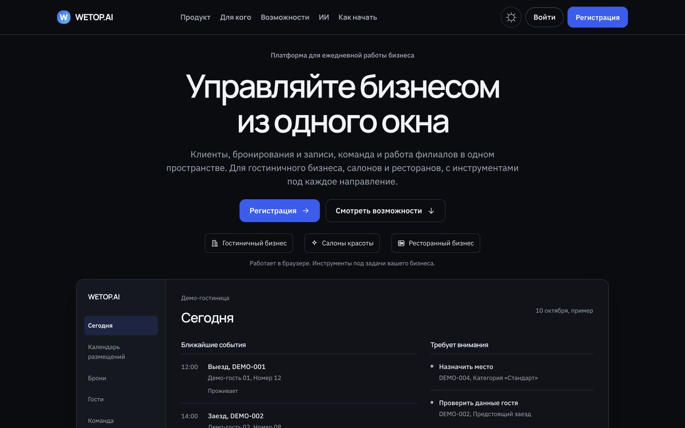
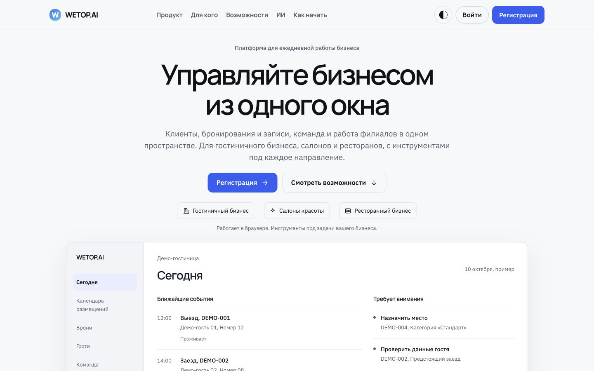
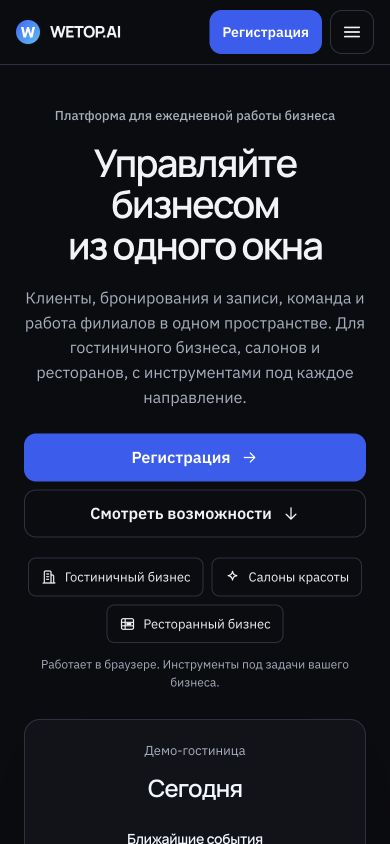
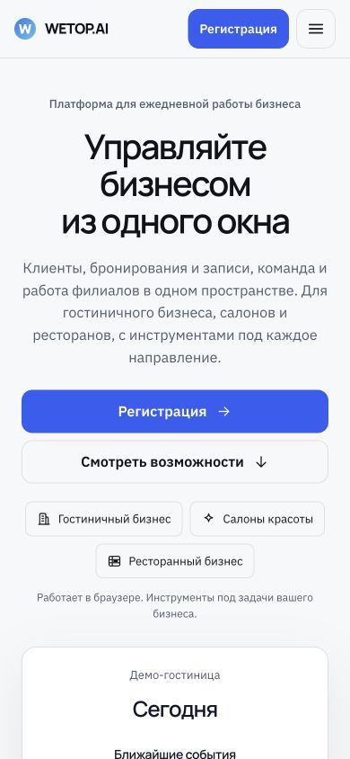
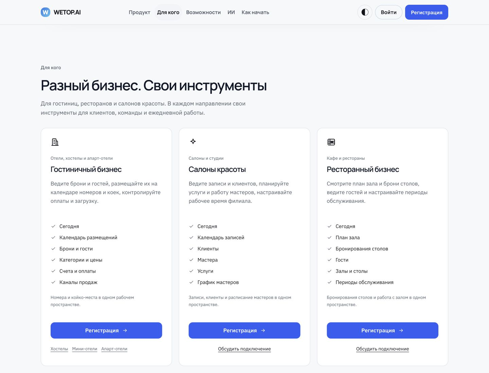
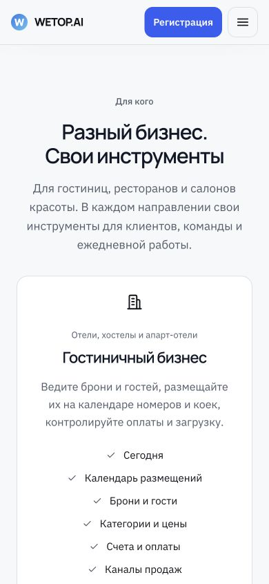

# PUBLIC-2: подача по типам бизнеса и мобильное центрирование

Уточнение владельца от 7 октября выполнено в [PR #281](https://github.com/GAIVER007/wetop.ai/pull/281). Визуальная композиция первого этапа сохраняется, публичная подача обновлена.

## Изменения

- Hero и карточки: «Гостиничный бизнес», «Салоны красоты», «Ресторанный бизнес». Публичные англоязычные названия направлений и ярлыки зрелости сняты.
- По шесть существующих возможностей для каждого направления. Ресторанный блок описывает столы, бронирования, гостей, залы и периоды обслуживания. Салонный блок описывает записи, клиентов, мастеров, услуги и график. Дополнительные функции не придуманы.
- Во всех карточках «Регистрация» ведёт в существующий AuthDialog с выбором направления. Контактная ссылка «Обсудить подключение» берётся из настроек.
- В форме вместо публичного ярлыка указано «По приглашению», инструкция просит согласованную почту. Canonical availability и серверные правила подключения сохранены. Реестр, API, схема, trial и pricing не менялись.
- На мобильном центрированы заголовок раздела, описание, карточки, иконки, списки возможностей, ссылки и заголовки Today. Строки событий Today сохраняют читаемое выравнивание времени и деталей.

## Проверки

- RED нового договора: 1/1 FAIL до реализации, `tests/runs/logs/2026-10-07T13-02-27Z-e2e-a0a0.log`.
- Полный site Playwright: 64/64 PASS, `tests/runs/logs/2026-10-07T13-04-10Z-e2e-cad0.log`. Включает static build, axe, 320/390/768/1440 в обеих темах, отсутствие overflow, keyboard/focus и выбор направления регистрации.
- DESIGN guard: 6/6 PASS. Site typecheck и lint: PASS. git diff --check: PASS.
- Новый тест проверяет отсутствие прежних ярлыков в Hero и карточках и мобильное text-align:center. Существующие сценарии регистрации сохранены.
- Unified auth не запускался повторно: прежний отказ защищённых маршрутов apps/web остаётся отдельным ограничением, [предыдущий отчёт](../public-homepage-v2-slice1-2026-10-07/README.md#ограничение-unified-auth). В этой правке apps/web не менялся.

## Новый первый экран

| Dark, 1440×900 | Light, 1440×900 |
| --- | --- |
|  |  |

| Dark, 390×844 | Light, 390×844 |
| --- | --- |
|  |  |

## Карточки

Desktop 1440×1100, все три карточки целиком:

Mobile 390×844, центрирование раздела и начало первой карточки:

Скриншоты сняты через настоящий браузер со статической сборки. Предыдущий отчёт и его кадры сохранены как история первого согласования. Новые auth-снимки находятся в `test-screenshots/` этой папки.

Это корректировка первого визуального этапа. Следующие секции и полный финальный QA описаны в основном плане; draft PR не merge и не deploy в этом этапе.
