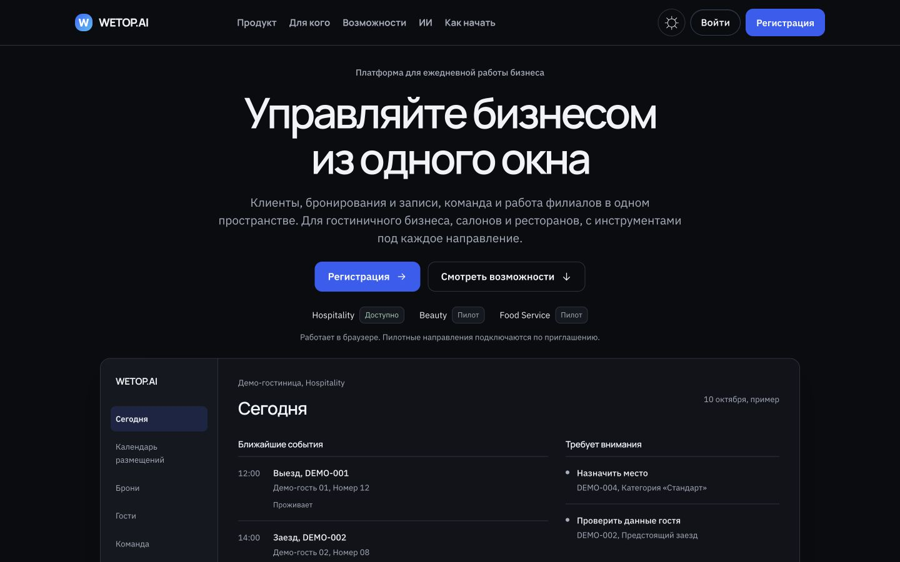
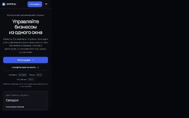
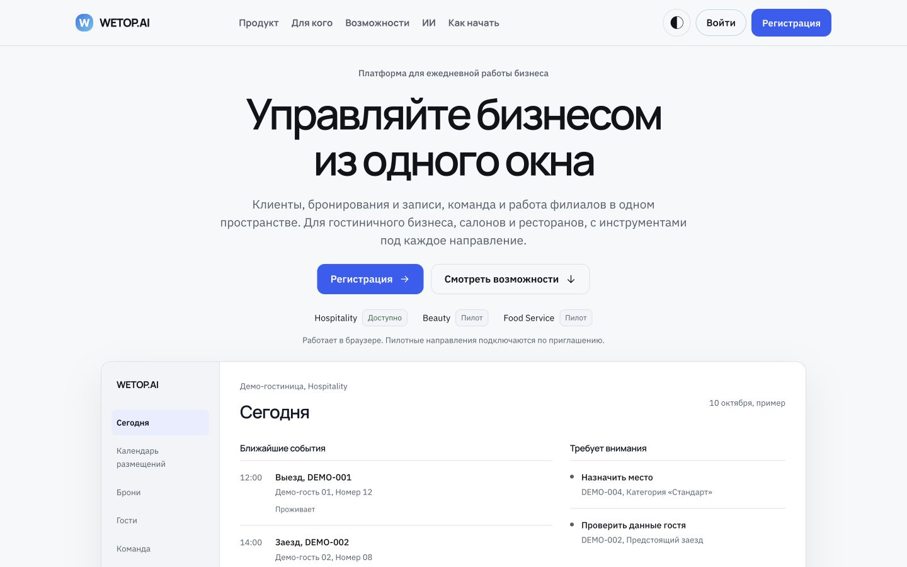
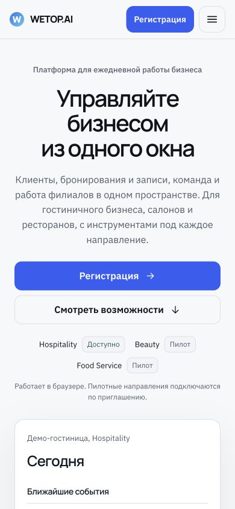
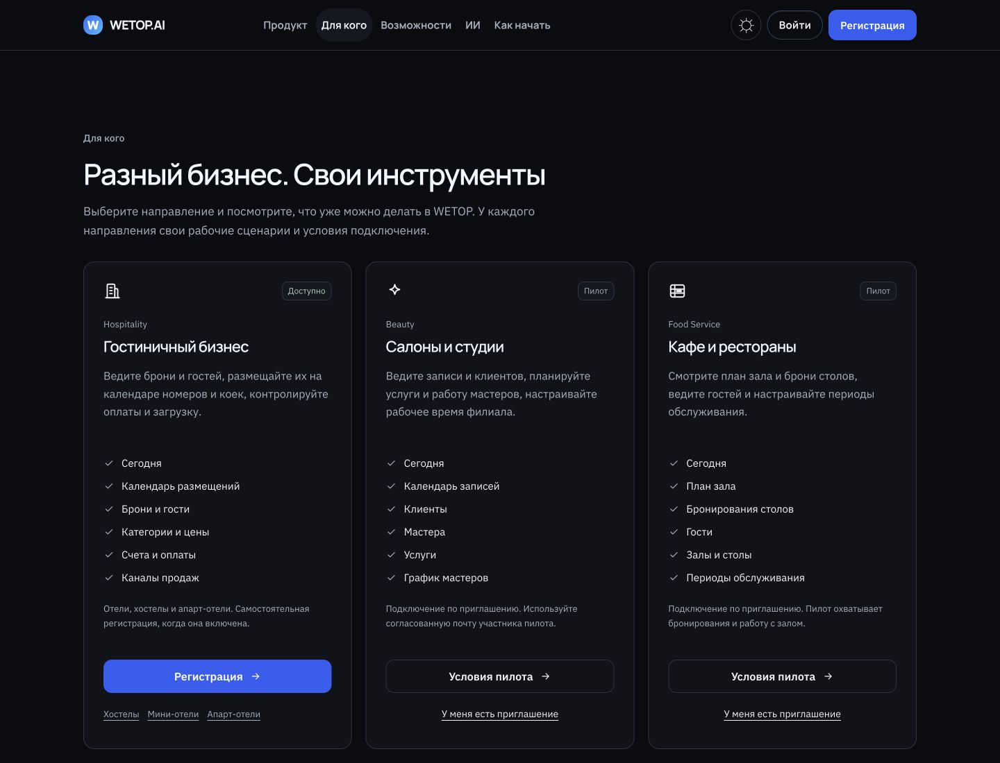
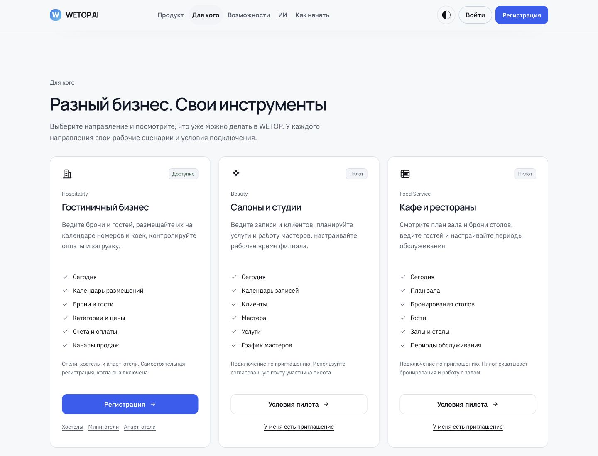

# PUBLIC-2: первый визуальный этап, 7 октября 2026

Статус: подготовлен для визуального согласования. STOP до следующих секций и до deploy. Это первый implementation PR, не финальная готовность главной.

PUBLIC-1 принят владельцем, решения записаны в плане и отчёте. PR #278 переведён в ready и merged: `867a3914ca065f1c452c8613adc8aa8a53c39032`. Свежий main с этим SHA стал базой ветки `codex/public-2-visual-slice-1`.

## Preflight и границы

Работа выполнена одним агентом в `/tmp/wetop-public1-20261007`. Исходный checkout WETOP имеет недоступный dataless Git pack; код и индекс исходного checkout не менялись. Перед началом независимый clone чистый, замки отсутствовали. Ни один тест этого этапа не подключает общую dev-БД: site использует статическую сборку и mock bridge, unified-auth использует локальный fixture API.

Изменены apps/site, проверки сайта, реестр визуальных блоков DESIGN.md и ADR-PUBLIC2-INTRO. apps/web, apps/api, apps/sites, packages/domain, модель данных, миграции, trial, pricing, allowlist пилотов и production не изменены.

## Что реализовано

- Шапка WETOP.AI, пять утверждённых якорей, вход и сплошная синяя регистрация. На телефоне регистрация остаётся видимой рядом с меню.
- Hero A: «Управляйте бизнесом из одного окна», утверждённый lead, две кнопки, Hospitality / Доступно и Beauty + Food Service / Пилот.
- Крупный статический пример Today: события, места, список внимания. Данные DEMO вымышленные, финансовых показателей нет, элементы макета не являются кнопками. Подпись: «Пример интерфейса. Данные вымышленные.»
- Три карточки направлений сразу после Hero, по шесть проверенных возможностей, разные условия подключения. Статусы читаются из `verticalDefinition`, без нового контракта доступности.
- Пилоты: configured email для «Условия пилота», существующий AuthDialog для «У меня есть приглашение» с vertical query. Выбор нужного направления проверен в браузерном тесте. Серверный допуск не менялся.
- Светлая и тёмная палитры Quiet Intelligence, плоские поверхности, спокойные границы, видимый focus, без перспективы и постоянных эффектов. Desktop H1 64-72 px, tablet 52 px, mobile 36-42 px. CTA минимум 44 px, Hero CTA 48 px.
- Старый мобильный dock и полоса Facts сняты с главной в пользу утверждённой композиции первого этапа. Остальные нижние секции оставлены для последующих этапов.
- Утверждённые SEO title и description внесены. Метаданные и canonical проверены site-набором; новый OG bitmap ещё предстоит финальному этапу.

A и B ниже обозначают две темы одного прототипа. H1 в обеих темах остаётся утверждённым Hero A.

## Прототип A: dark

1440×900, первый экран:

390×844, первый экран:

## Прототип B: light

1440×900, первый экран:

390×844, первый экран:

## Карточки направлений

1440×1100, отдельный кадр карточек целиком:

Скриншоты получены из настоящей статической сборки через браузер. Это локальный прототип, публичное приложение не обновлялось.

## Проверки и доказательства

| Проверка | Результат | Доказательство |
| --- | --- | --- |
| RED нового договора первого экрана | 8/8 падений до реализации, старый гостиничный H1 | `tests/runs/logs/2026-10-07T12-38-50Z-e2e-180f.log` |
| Полный site Playwright после реализации | 63/63 PASS | `tests/runs/logs/2026-10-07T12-51-42Z-e2e-6e4f.log` |
| Build | PASS, статический export встроен в полный site run | тот же site log |
| Axe | 0 violations для шапки, Hero и карточек на 320/390/768/1440 в обеих темах; существующий полный WCAG-набор также PASS | `public-intro.spec.ts`, `landing.spec.ts`, `homepage-blocks.spec.ts` |
| Adaptive / overflow | PASS на всех четырёх ширинах; видимая регистрация в шапке; начало preview в первом mobile viewport | site tests + скриншоты |
| Keyboard / focus нового mobile CTA | Enter открывает AuthDialog, Escape закрывает и возвращает focus на видимый trigger | `public-intro.spec.ts` |
| Pilot entry points | Beauty/Food preselected, формы не отправляются | `public-intro.spec.ts` |
| Reduced motion | существующие проверки главной PASS | `homepage-blocks.spec.ts` |
| Site typecheck | PASS | `npx tsc -p apps/site/tsconfig.json --noEmit` |
| Lint site + изменённые tests | PASS | `npx eslint apps/site/src tests/site/public-intro.spec.ts tests/site/homepage-blocks.spec.ts tests/site/landing.spec.ts tests/site/auth-dialog.spec.ts` |
| DESIGN guard | 6/6 PASS | `tests/runs/logs/2026-10-07T12-52-59Z-unit-51c5.log` |
| Unified auth | 3/7 PASS, 4 FAIL | `tests/runs/logs/2026-10-07T12-47-47Z-e2e-b781.log` |
| Baseline protected /today | 1/1 FAIL на исходных tracked apps/site из main | `tests/runs/logs/2026-10-07T12-50-01Z-e2e-68ef.log` |
| git diff --check | PASS | перед commit |

Ожидания прежних тестов обновлены под прямые решения владельца: платформенный H1, статический Today, пилотные карточки и отсутствие dock/Facts. Поведенческие проверки входа, писем, повторов, закрытой регистрации, sitemap, SEO и остальных страниц сохранены. Скриншоты auth-тестов теперь сохраняются в папку этого этапа, прежние evidence не перезаписываются.

## Ограничение unified-auth

Прошли старые адреса форм, регистрация с подтверждением и no-JS резервный вход. Падают три защищённых маршрута `/today`, `/chessboard`, `/reservations` и сценарий новой вкладки/выхода. В protected-route случае ожидался переход на PUBLIC главную с `#login`, фактически браузер остаётся на адресе стойки с `API_401` и «Филиал недоступен».

Baseline проверен отдельно: исходные tracked файлы apps/site из merge SHA PUBLIC-1, тот же конфиг, только protected `/today`. Падение воспроизводится до изменений PUBLIC-2. Затем текущие исходники восстановлены и полный site-набор пройден. Код apps/web не исправлялся, потому что это прямой запрет текущего scope. Общий auth-набор не объявляется зелёным.

## Что ещё не завершено

- Секции «Одна платформа», showcase, capabilities, AI, marketing, start, FAQ, финальный CTA и footer по полному плану.
- Удаление старых спорных обещаний в нижних секциях, включая скорость каналов и draft agents. Поэтому этот PR нельзя выкладывать как финальный PUBLIC-2.
- Отдельный auth этап: solid CTA формы, phone 320, focus после входа из скрытого меню, клавиатурная навигация tabs. Новый видимый header trigger проверен, старый menu-trigger не выдан за исправленный.
- Полная финальная проверка short viewport, OS keyboard, 200% zoom, OG bitmap и всех финальных секций.
- Визуальное подтверждение владельцем и отдельное разрешение на deploy.

STOP: без следующего подтверждения не реализовывать оставшиеся секции, не merge этот implementation PR и не deploy.
